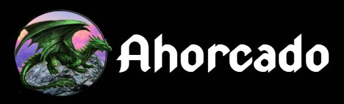
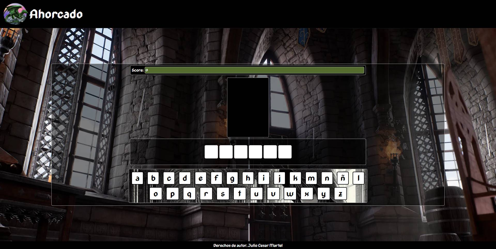
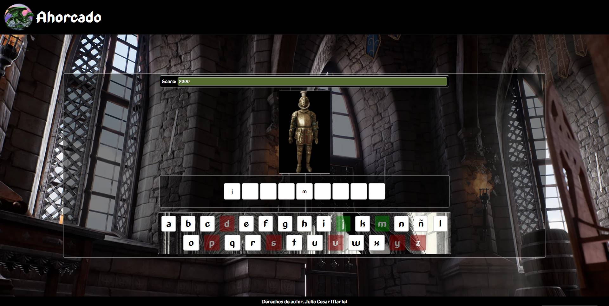
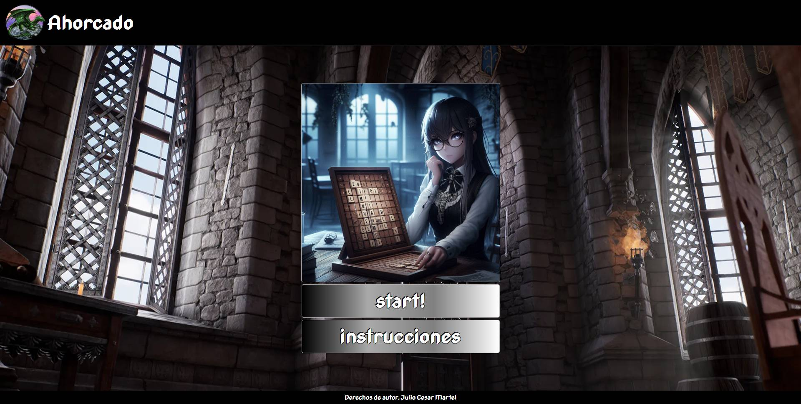

# ahorcado

  
   
  Este es un clásico juego del ahorcado desarrollado con JavaScript, HTML y CSS. El objetivo del juego es adivinar una palabra oculta antes de que el dibujo del ahorcado se complete. Cada letra incorrecta acerca al jugador a la derrota, mientras que cada acierto revela 
  parte de la palabra.

  
  
  

  

